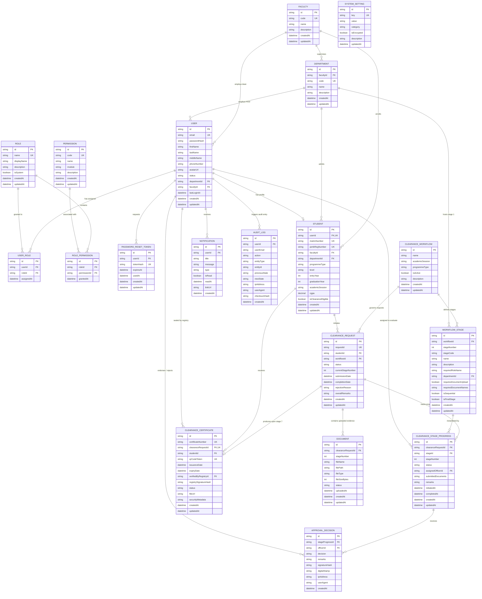

# Entity-Relationship Diagram (ERD) & Database Architecture Summary

**System:** Electronic Clearance Management System (ECMS)  
**Institutions:** Federal University of Technology, Minna (FUTMINNA) & Federal Polytechnic Offa (FEDPOFFA)  
**Reference Schema:** `prisma/schema.prisma`  
**Database Engine:** Relational Database (MySQL / PostgreSQL / Prisma In-Memory Engine)

---

## 1. Architectural Overview & Design Philosophy

The database architecture is designed as a third-normal-form (3NF) relational schema that enforces strict institutional governance, immutable auditability, and role-based access control (RBAC). The schema cleanly decouples:

1. **Authentication Identity (`User`)** from **Academic Profile (`Student`)** via a normalized 1-to-1 relationship, preventing duplicate identity records while supporting both students and administrative officers.
2. **Clearance Workflow Definition (`ClearanceWorkflow`, `WorkflowStage`)** from **Runtime Execution State (`ClearanceRequest`, `ClearanceStageProgress`)**, enabling configurable multi-session academic workflows without schema migrations.
3. **Operational State (`ClearanceRequest`)** from **Tamper-Evident Evidence (`ApprovalDecision`, `ClearanceCertificate`, `AuditLog`)**, ensuring that approvals, signatures, and issued credentials remain verifiable even if operational records are archived.

---

## 2. Logical Entity Classification & Descriptions

The 16 core entities are categorized into four cohesive functional domains:

### Category 1: Identity, Authentication & Role-Based Access Control (RBAC)

* **`User`**: Central authentication record capturing credentials, full names, institutional contact information, account status, and optional department/faculty administrative affiliations.
* **`Role`**: Canonical security personas governing system capabilities (e.g., `STUDENT`, `HOD`, `DEAN`, `LIBRARIAN`, `BURSAR`, `STUDENT_AFFAIRS`, `ICT_DIRECTOR`, `REGISTRY`, `SUPER_ADMIN`).
* **`Permission`**: Granular operational privileges organized by functional module (e.g., `CLEARANCE_STAGE_APPROVE`, `CERTIFICATE_GENERATE`, `AUDIT_VIEW`).
* **`UserRole`**: Normalized junction entity establishing a many-to-many relationship between users and their assigned administrative roles.
* **`RolePermission`**: Normalized junction entity mapping granular permissions to specific system roles.
* **`PasswordResetToken`**: Secure, time-bounded SHA-256 cryptographic hash tokens enabling self-service credential recovery.

### Category 2: Academic & Institutional Structure

* **`Faculty`**: Top-level academic division grouping related departments across the polytechnic and affiliate university structure.
* **`Department`**: Primary academic unit responsible for student degree curricula, lab handovers, project hardcovers, and Stage 1 HOD clearance sign-off.
* **`Student`**: Normalized student academic ledger storing institutional matriculation numbers, JAMB registration codes, degree programme types, academic sessions, cumulative grade point averages (CGPA), and clearance eligibility flags.

### Category 3: Clearance Workflow, Requests & Endorsement

* **`ClearanceWorkflow`**: Workflow template header defining the active clearance session, academic cycle, and programme scope (e.g., Affiliate B.Tech Degree vs. National Diploma).
* **`WorkflowStage`**: Template configuration defining the 7 sequential clearance checkpoints (`DEPT`, `FACULTY`, `LIBRARY`, `BURSARY`, `STUDENT_AFFAIRS`, `ICT_PORTAL`, `REGISTRY`), required officer roles, and document upload requirements.
* **`ClearanceRequest`**: Primary clearance application initiated by a student, maintaining overall lifecycle status (`SUBMITTED`, `IN_PROGRESS`, `COMPLETED`, `REJECTED`) and tracking the currently active sequential stage number.
* **`ClearanceStageProgress`**: Runtime state record tracking each of the 7 stages for a specific clearance request, recording individual stage status (`NOT_STARTED`, `PENDING`, `APPROVED`, `REJECTED`), assigned officers, and timestamp logs.
* **`ApprovalDecision`**: Formal immutable endorsement or corrective rejection logged by a stage officer, capturing signature hashes, digital stamps, officer remarks, client IP addresses, and user-agent strings.
* **`ClearanceCertificate`**: Legally binding electronic clearance certificate generated automatically upon completion of Stage 7, storing the canonical certificate number, verification QR code token, Academic Registry signature hash, and validity status.

### Category 4: Supporting Records, Evidence & Governance

* **`Document`**: Electronic artifacts and payment evidence (e.g., Remita receipts, project CDs, bursary waivers) uploaded by students and tied to specific clearance stages.
* **`Notification`**: Real-time asynchronous alerts dispatched to students and officers regarding stage endorsements, corrective feedback, or certificate readiness.
* **`AuditLog`**: Append-only security ledger capturing system transactions with before/after state snapshots, user metadata, and SHA-256 integrity checksums.
* **`SystemSetting`**: Dynamic key-value configuration table controlling institutional naming, strict sequential workflow enforcement flags, and QR verification endpoints.

---

## 3. Entity Relationships & Foreign Key Matrix

| Source Entity | Relationship | Target Entity | Foreign Key Field | Cardinality | Business Description |
| :--- | :---: | :--- | :--- | :---: | :--- |
| `User` | $\rightarrow$ | `Department` | `departmentId` | $N:1$ | Assigns officer to an academic department |
| `User` | $\rightarrow$ | `Faculty` | `facultyId` | $N:1$ | Assigns dean to an academic faculty |
| `User` | $\leftrightarrow$ | `Student` | `userId` | $1:1$ | Links login identity to student academic profile |
| `UserRole` | $\rightarrow$ | `User` | `userId` | $N:1$ | Maps user to role assignment |
| `UserRole` | $\rightarrow$ | `Role` | `roleId` | $N:1$ | Maps role to user assignment |
| `RolePermission` | $\rightarrow$ | `Role` | `roleId` | $N:1$ | Associates permission with role |
| `RolePermission` | $\rightarrow$ | `Permission` | `permissionId` | $N:1$ | Associates role with privilege |
| `Department` | $\rightarrow$ | `Faculty` | `facultyId` | $N:1$ | Establishes department faculty hierarchy |
| `Student` | $\rightarrow$ | `Faculty` | `facultyId` | $N:1$ | Associates student with faculty |
| `Student` | $\rightarrow$ | `Department` | `departmentId` | $N:1$ | Associates student with major department |
| `WorkflowStage` | $\rightarrow$ | `ClearanceWorkflow` | `workflowId` | $N:1$ | Binds stage definitions to master workflow |
| `ClearanceRequest`| $\rightarrow$ | `Student` | `studentId` | $N:1$ | Tracks student clearance request ownership |
| `ClearanceRequest`| $\rightarrow$ | `ClearanceWorkflow` | `workflowId` | $N:1$ | Governs request by active workflow rules |
| `ClearanceStageProgress` | $\rightarrow$ | `ClearanceRequest` | `clearanceRequestId` | $N:1$ | Tracks 7 individual stage records per request |
| `ClearanceStageProgress` | $\rightarrow$ | `WorkflowStage` | `stageId` | $N:1$ | Links stage progress to template configuration |
| `ClearanceStageProgress` | $\rightarrow$ | `User` | `assignedOfficerId` | $N:1$ | Records officer assigned to review stage |
| `ApprovalDecision` | $\rightarrow$ | `ClearanceStageProgress` | `stageProgressId` | $N:1$ | Records officer decision on stage progress |
| `ApprovalDecision` | $\rightarrow$ | `User` | `officerId` | $N:1$ | Identifies officer who signed decision |
| `Document` | $\rightarrow$ | `ClearanceRequest` | `clearanceRequestId` | $N:1$ | Associates evidence document with request |
| `ClearanceCertificate` | $\leftrightarrow$ | `ClearanceRequest` | `clearanceRequestId` | $1:1$ | Grants certificate to cleared request |
| `ClearanceCertificate` | $\rightarrow$ | `Student` | `studentId` | $N:1$ | Links certificate to student profile |
| `ClearanceCertificate` | $\rightarrow$ | `User` | `verifiedByRegistryId` | $N:1$ | Records registry officer issuing certificate |
| `Notification` | $\rightarrow$ | `User` | `userId` | $N:1$ | Routes notification to specific user |
| `AuditLog` | $\rightarrow$ | `User` | `userId` | $N:1$ | Captures actor responsible for audit event |
| `PasswordResetToken` | $\rightarrow$ | `User` | `userId` | $N:1$ | Issues password reset token to user |

---

## 4. Complete Mermaid Entity-Relationship Diagram

The following Mermaid diagram visualizes the complete database schema with primary keys (`PK`), foreign keys (`FK`), unique attributes (`UK`), and normalized relationship cardinalities:

---

## 5. Architectural Alignment with Dissertation Methodology

1. **Strict 7-Stage Enforcement via Schema Constraints**:
   - `ClearanceStageProgress` records are uniquely indexed by `(clearanceRequestId, stageId)`, ensuring that exactly 7 stage progress nodes exist per clearance application.
   - The sequential pointer `ClearanceRequest.currentStageNumber` guarantees that out-of-order transitions are rejected by the application and verified against `WorkflowStage.stageNumber`.

2. **Immutable Academic Audit Trail**:
   - Every approval or rejection is permanently stored in `ApprovalDecision` with an SHA-256 digital signature hash, originating IP address, and browser/system user agent.
   - The global `AuditLog` table maintains an unbroken chain of operational state transitions (`previousState` $\rightarrow$ `newState`) linked by checksums.

3. **Tamper-Evident Certificate Verification**:
   - `ClearanceCertificate` is cryptographically tied to the student's unique identity (`studentId`), master clearance request (`clearanceRequestId`), and unique offline/online validation QR code (`qrCodeToken`).
   - The Academic Registry officer's signature hash is captured directly on the certificate record and embedded into both the visual certificate and the downloadable server-generated PDF document.
